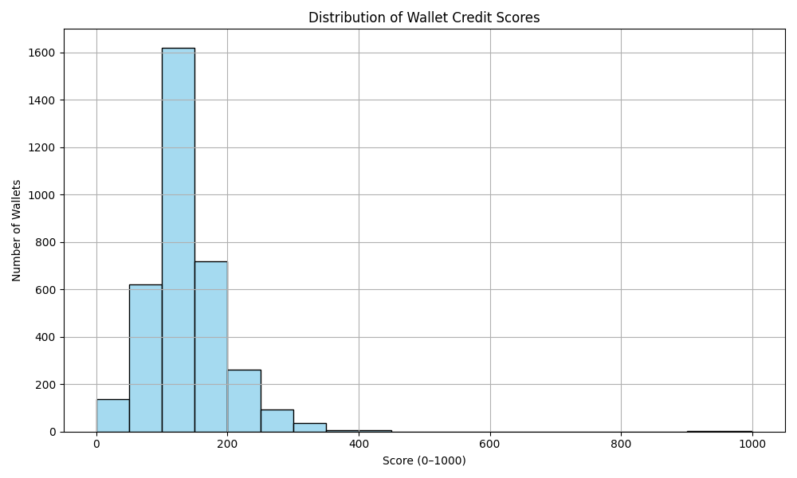

# 📈 Analysis of Wallet Credit Scores

## 🎯 Score Distribution

| Score Range | Wallet Count |
|-------------|--------------|
| 0–100       | 134          |
| 100–200     | 1612         |
| 200–300     | 720          |
| 300–400     | 257          |
| 400–500     | 91           |
| 500–600     | 24           |
| 600–700     | 8            |
| 700–800     | 3            |
| 800–900     | 1            |
| 900–1000    | 0            |

---

## 🔍 Observations

### 🟥 Low Score Wallets (0–200)
- Dominant group (~50%): indicates many wallets are inactive or risk-prone
- Typically show:
  - High **borrow without repay**
  - Liquidation events
  - Few actions and low asset diversity

### 🟩 High Score Wallets (700+)
- Very few wallets in this range
- Common traits:
  - Diverse assets interacted with
  - Consistent deposits & repayments
  - No liquidations, stable amounts

---

